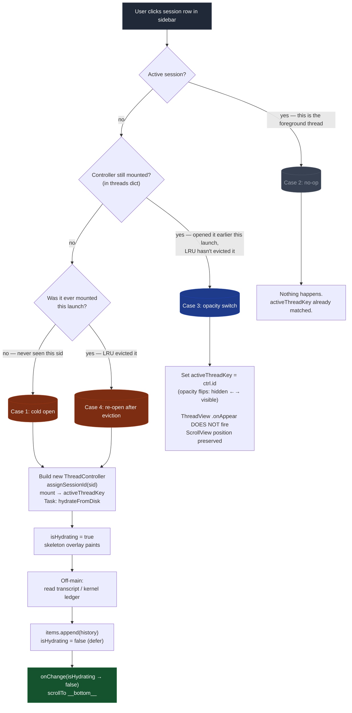
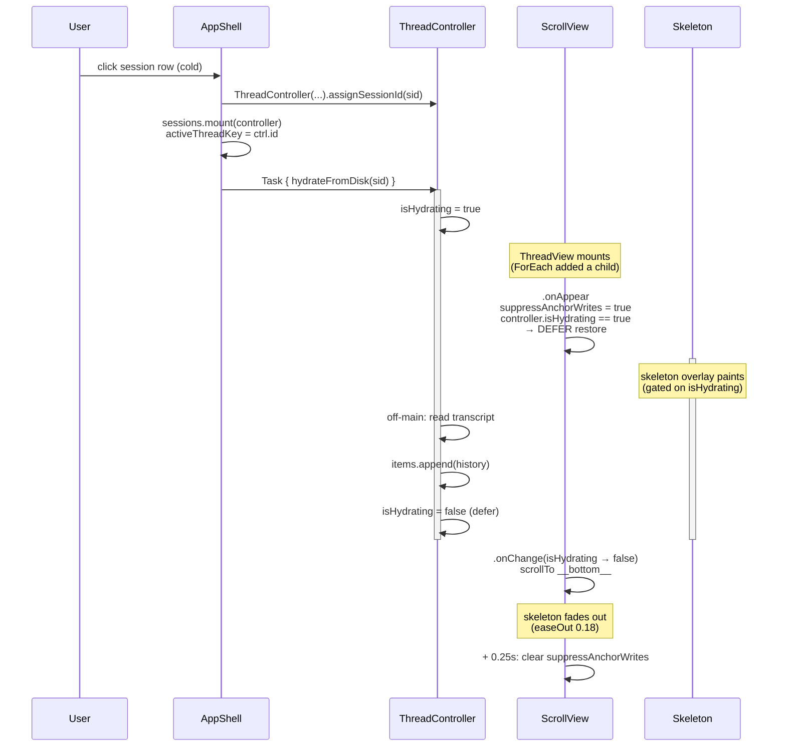

# Thread lifecycle — clicks, controllers, scroll restore

Quick mental model for "where does the user land when they click X?"

There are **two independent state machines** in play:

1. **`ThreadController` lifecycle.** Lives in `AppSessionCoordinator.threads[id]`. Up to 3 alive at a time (LRU cap, -220). A controller is *mounted* when it's in the dict and *torn down* when LRU evicts it.
2. **`ThreadView` SwiftUI lifecycle.** One ThreadView per mounted controller (ForEach in AppShell). Mount-once, opacity-toggle visibility — switching between threads does NOT remount the view.

The scroll-restore logic lives at the intersection. The user-facing question — "where does the scroll land?" — is fully determined by which of four cases the click hits.

---

## The four user actions, by case



### What each case lands on

| Case | Click target | Scroll lands at |
|---|---|---|
| **1. Cold open** | Session never seen this launch | **Bottom** (always) |
| **2. No-op** | Already-active session | Wherever you left it |
| **3. Opacity switch** | Mounted but inactive (you'd opened it earlier and switched away) | **Wherever you left it** (preserved across opacity toggle) |
| **4. Re-open after eviction** | Mounted earlier this launch but LRU evicted it | **Bottom** (same code path as Case 1 — controller is rebuilt from scratch) |

> **Insight:** Cases 1 and 4 are indistinguishable to the system. From the controller's perspective, it's being built fresh in both. Both go through `hydrateFromDisk` → skeleton → bottom.

---

## The "re-attach" case (theoretical)

There's a fifth case I mentioned in the task notes but it's *rarely triggered in normal use*:

- **Case 5: ThreadView re-mounts on a still-hydrated controller.** ScrollView's `.onAppear` fires while `controller.isHydrating` is already `false`. This would happen if SwiftUI tears down and re-creates the view structure (window resize triggering a major restructure, parent `.id()` change, etc.) without touching the underlying controller.

In this case, the `.onAppear` path runs `performScrollRestore(proxy:)` which respects the saved anchor (`controller.scrollAnchorAtBottom` / `scrollAnchorItemId`). The user would land where they last were.

You won't normally hit this through user actions in the current AppShell — opacity-toggle (Case 3) is the user-visible "switch threads" path and it doesn't trigger `.onAppear`.

---

## ScrollView lifecycle in time



---

## Why "fresh = bottom, re-attach = saved anchor"

Two different UX intents:

- **Fresh open (Case 1, 4):** the user is opening this session to **see what happened**. Most recent message is the answer to "what's the latest?" Bottom is right.
- **Re-attach (Case 3, hypothetical Case 5):** the user was reading at a specific point, opened another thread, came back. They want to resume reading, not jump to the end. Saved anchor is right.

The previous bug was that fresh open *also* read the saved anchor, but the saved anchor was the **default** `scrollAnchorAtBottom = true` value (no real prior position because the controller is brand new). That **should have** landed at bottom — but the scroll fired against an empty ScrollView (hydrate hadn't completed yet), no-opped, then row `.onAppear` handlers flipped the anchor based on whatever happened to be top-of-viewport. Final position = race winner.

Fix in -233:

```
Old:                                  New:
.onAppear fires immediately            .onAppear: if !isHydrating → restore now
  → scrollTo bottom on empty view      .onChange(isHydrating → false) → scrollTo bottom
  → race with row handlers
```

Plus: row `.onAppear/.onDisappear` now respect `suppressAnchorWrites` so they can't clobber state during the restore window.

---

## Where each piece of state lives

| State | Type | Lives in | Lifetime |
|---|---|---|---|
| `threads: [String: ThreadController]` | dict | `AppSessionCoordinator` | app launch |
| `activeThreadKey: String?` | id | `AppSessionCoordinator` | app launch |
| `threadRecency: [String]` | LRU order | `AppSessionCoordinator` | app launch |
| `isHydrating: Bool` | per-controller | `ThreadController` | controller lifetime |
| `items: [ThreadItem]` | per-controller | `ThreadController` | controller lifetime |
| `scrollAnchorAtBottom: Bool` | per-controller | `ThreadController` | controller lifetime |
| `scrollAnchorItemId: String?` | per-controller | `ThreadController` | controller lifetime |
| `anchor.atBottom / .itemId / .visibleIds` | per-view | `ThreadView`'s `@State ScrollAnchor` | view mount |
| `suppressAnchorWrites: Bool` | per-view | `ThreadView`'s `@State` | view mount |

The two `anchor` pairs at the bottom mirror each other: view-local for hot writes during scroll (no `@Bindable` invalidation per -094/-096), flushed back to controller on `.onDisappear`.
